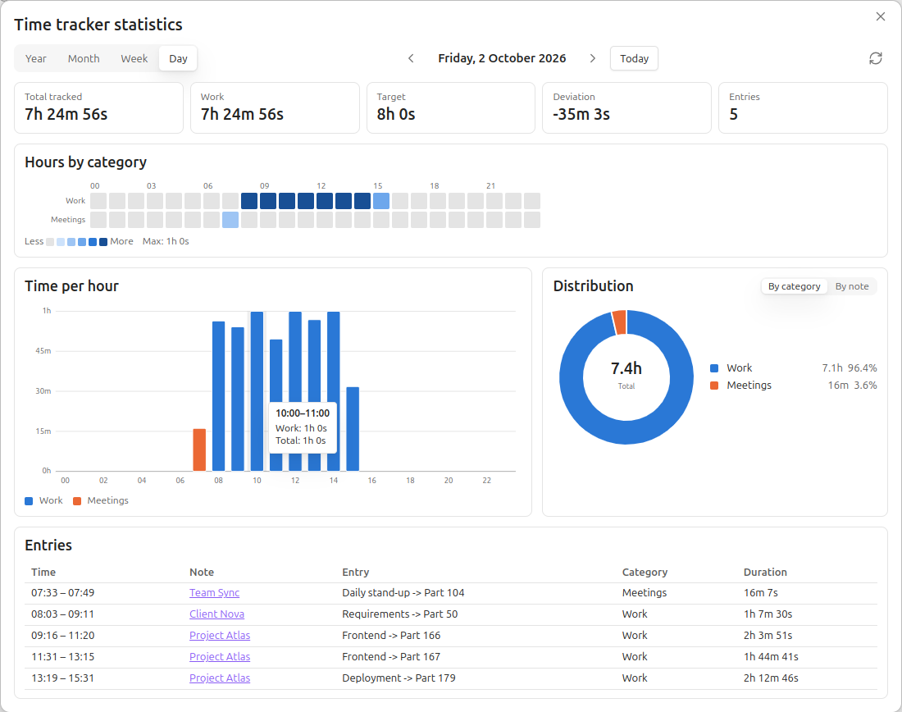
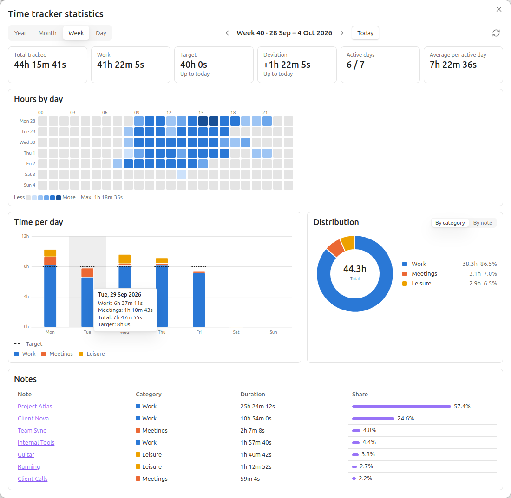
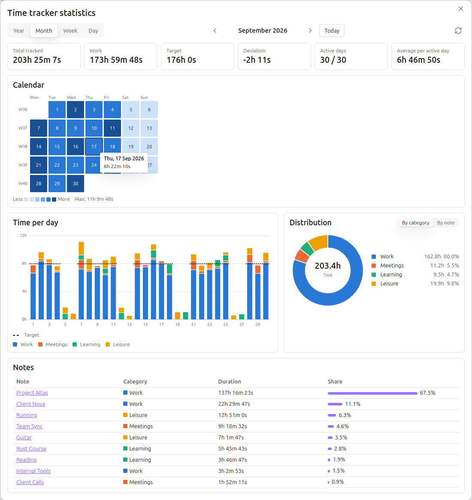
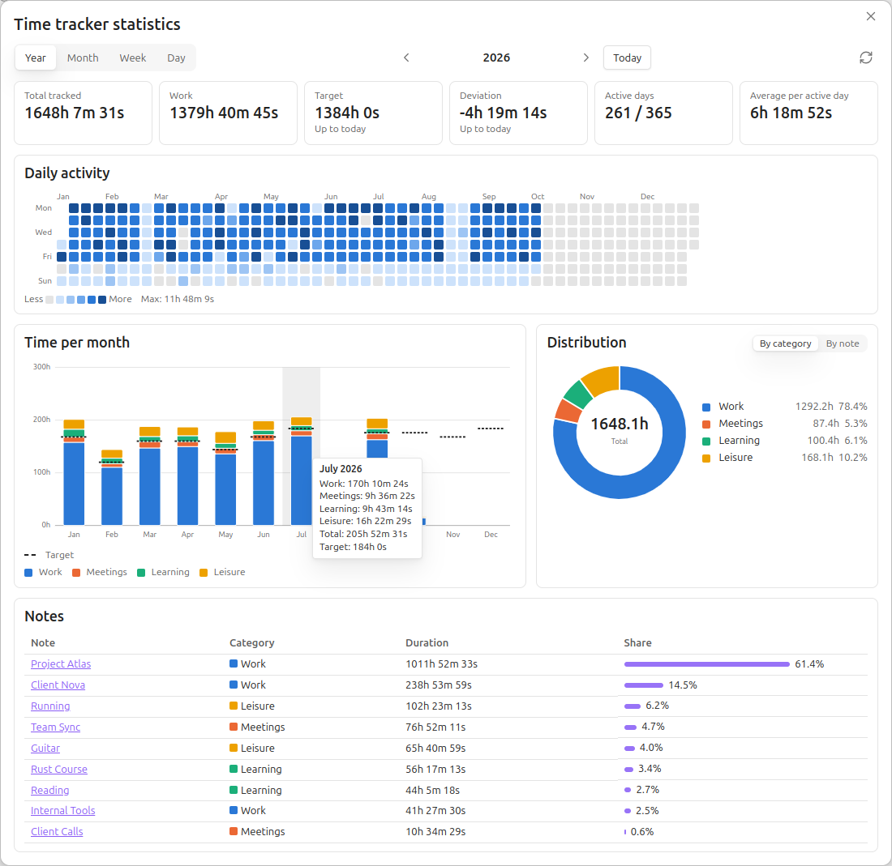
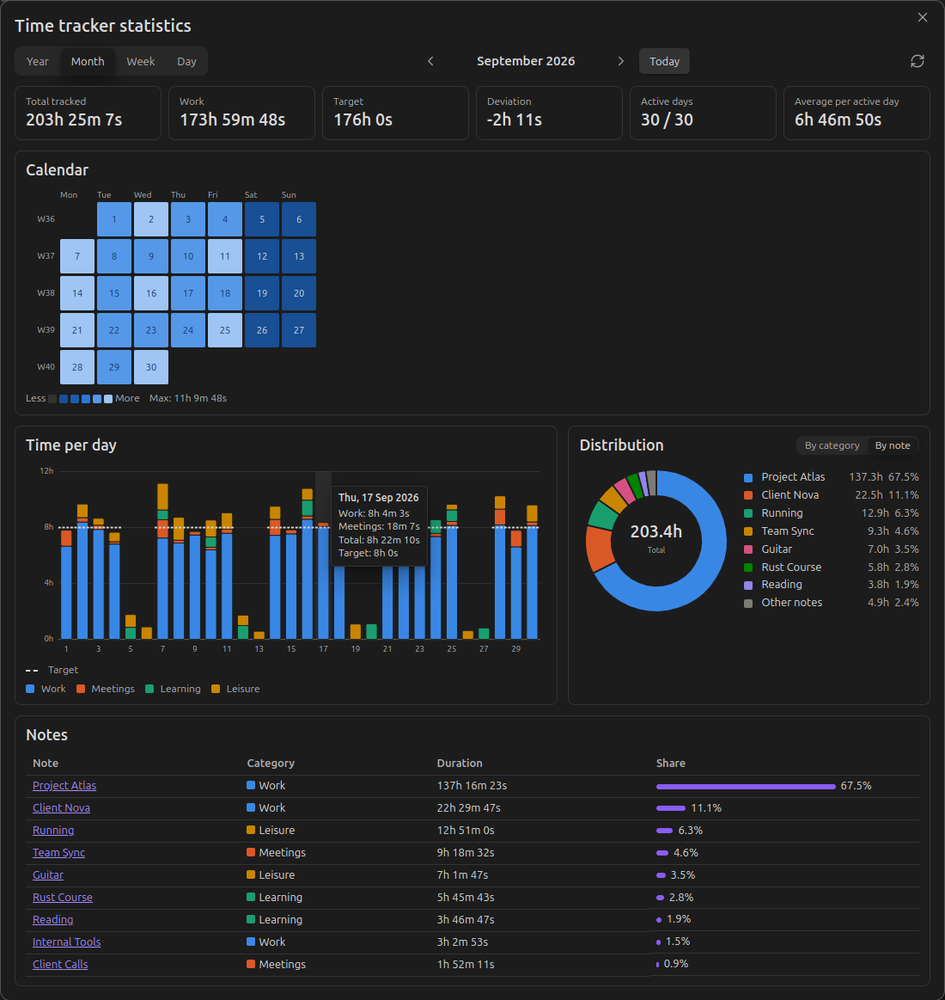

# Obsidian Time Tracker Statistics

This is a statistics companion plugin for the **[Super Simple Time Tracker](https://github.com/Ellpeck/ObsidianSimpleTimeTracker)** by [Ellpeck](https://github.com/Ellpeck).
It collects the time tracked in all notes of your vault and summarises it in daily and monthly reports: time per category, per entry and per note, compared against your daily targets.

- Summarises tracked time without the need for custom scripts or coding.
- Identifies the relevant data based on the file's name.
    - **Daily**: Requires a `YYYY-MM-DD` format (e.g., `2026-02-01.md`).
    - **Monthly**: Requires a year and month index (e.g., `2026-02.md`).
- Automatically groups tracked entries into categories based on file tags defined in your settings.
- You can add a target time for a category and the breakdown will show you how much you deviated from it. Weekends are excluded from the target automatically, and you can easily mark public holidays, vacation days and sick days so the deviation calculation takes them into account.
- The Daily view displays whether a tracker is currently running anywhere in your vault.

## Different Views

### 1. Daily Statistics

Provides a summary of all time tracked for a specific calendar day.
- **Command**: `Insert daily statistics`.
- **Code Block**: `simple-time-tracker-statistics-day`.

**Includes:**

- **Totals Table**: Breakdown of duration, remaining time, and overtime per category based on your set targets.
- **Entries Breakdown**: A detailed list of every entry, showing the source file and sub-entry hierarchy.
- **Running Tracker**: Displays a link to any active tracker found in the vault.

Entries are assigned to the day on which they were started, in your local time zone.

### 2. Monthly Statistics

A comprehensive report grouping entries by week and calculating long-term time balances.

- **Command**: `Insert monthly statistics`.
- **Code Block**: `simple-time-tracker-statistics-month`.

### 3. Statistics Dashboard

A popup window with interactive charts for the whole vault. It works independently of any note, so you can use it alongside the code blocks or instead of them.

- **Command**: `Open statistics dashboard` (also available from the ribbon icon) opens the Day view. To jump straight to a view, use `Open statistics dashboard: year view`, `… month view`, `… week view` or `… day view`.
- **Views**: Year, Month, Week and Day. Navigate with the arrow buttons, the left/right arrow keys or *Today*.

**Each view includes:**

- **Summary tiles**: Total tracked time, work time, target, deviation, active days and daily average. For the current period, target and deviation are counted up to today.
- **Heatmap**: A calendar of daily totals (Year, Month), or the time tracked per hour (Week: per day, Day: per category).
- **Bar chart**: Time per month, day or hour, stacked by category, with the daily target marked.
- **Distribution**: A donut chart of the tracked time by category or by note.
- **Table**: Time per note, or every entry of the day in the Day view.

Click a day in a heatmap or bar chart to open it in the Day view, or a month bar in the Year view to open that month. Targets respect the vacation, sick and off days set in the monthly notes. Hourly charts split entries by clock time, so an entry that runs past midnight appears on both days.

#### Day view

Hours by category, time per hour and every entry of the day.

#### Week view

An hour-by-day heatmap shows when you worked; the bars compare each day with the daily target.

#### Month view

A calendar heatmap of daily totals. Hover over any cell or bar for details.

#### Year view

A contribution-style heatmap of the whole year and the time per month against the monthly target.

#### Dark mode and distribution by note

## Managing Time Off

The Monthly view counts the daily work target for Monday to Friday only. Saturdays and Sundays never add to the target. You can exclude further days from your standard work obligations to keep your **Accumulated Deviation** accurate.

### Configuration Parameters

Adjust these values directly within the code block:

|Parameter|Type|Description|
|---|---|---|
|**`deviation`**|`auto` \| `number`|Deviation carried over from the previous month. `auto` calculates it from the previous month's note (see below). A number (in **milliseconds**) sets it manually, e.g. copied from the *Total accumulated deviation (ms)* row of the previous month's summary.|
|**`vacationDays`**|`number[]`|Days of the month to be excluded from work targets (e.g., `[1, 2, 3]`).|
|**`sickDays`**|`number[]`|Dates marked as sick leave; reduces the work target.|
|**`daysOff`**|`number[]`|Public holidays or other non-working days. Weekends don't need to be listed.|

### Automatic Carry-Over

With `deviation = auto` (the default for newly inserted blocks), the plugin looks for the previous month's note by its file name (e.g. `2026-09.md` for `2026-10.md`) and uses that month's total accumulated deviation as the starting value. The link to the source note is shown above the first week.

- If the previous note also uses `auto`, the plugin keeps going back month by month.
- The chain stops at the first note with a numeric `deviation`, or at the first month without a note (which counts as `0`).
- Past months are recalculated with your **current** category targets. If your targets changed, set a numeric `deviation` in the first month with the new targets to freeze the earlier values.

## Setting Up Categories

To make the statistics meaningful, map your vault's tags to categories in the **Plugin Settings**. The plugin comes pre-configured with two default categories: **Work** (target `08:00:00`) and **Leisure** (target `00:00:00`).

1. **Define a Category**: Give it a name.
2. **Assign Tags**: Add the tags you use to indicate the files associated with the category. By default, **Work** looks for `#work` and **Leisure** looks for `#leisure`.
3. **Set Targets**: Enter a daily target in `HH:mm:ss` format. If left blank, the target defaults to `00:00:00`.
4. **Monthly "Work" Tracking**: Every category with a target above `00:00:00` counts as work in the Monthly view. The daily target is the sum of these targets. Categories without a target are shown as "Other duration".

## Prerequisites

- **Simple Time Tracker**: Required for the underlying data and API.
- **Dataview**: Required for the plugin to scan and aggregate data.

## Roadmap

- Add yearly summaries as a code block (the dashboard already has a Year view).
