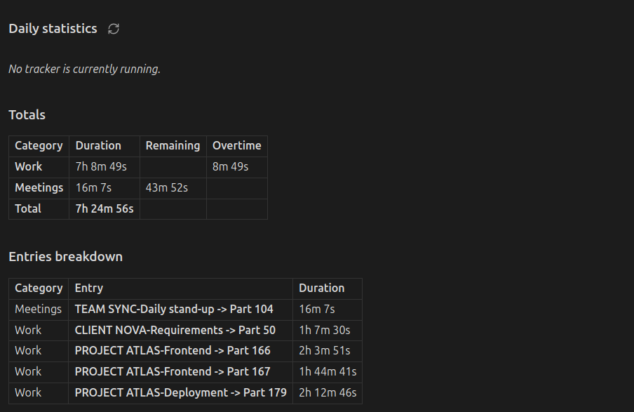
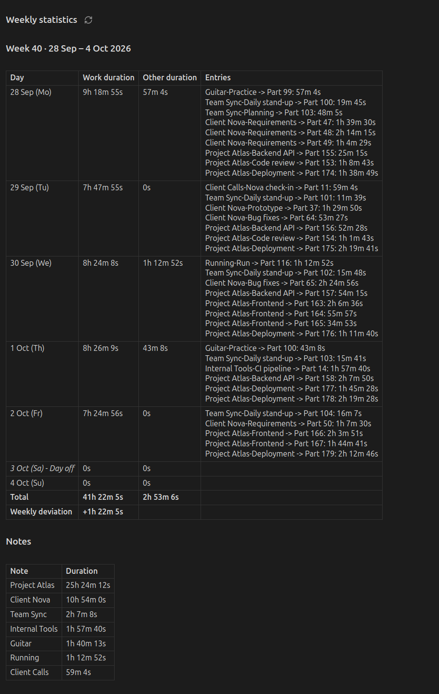
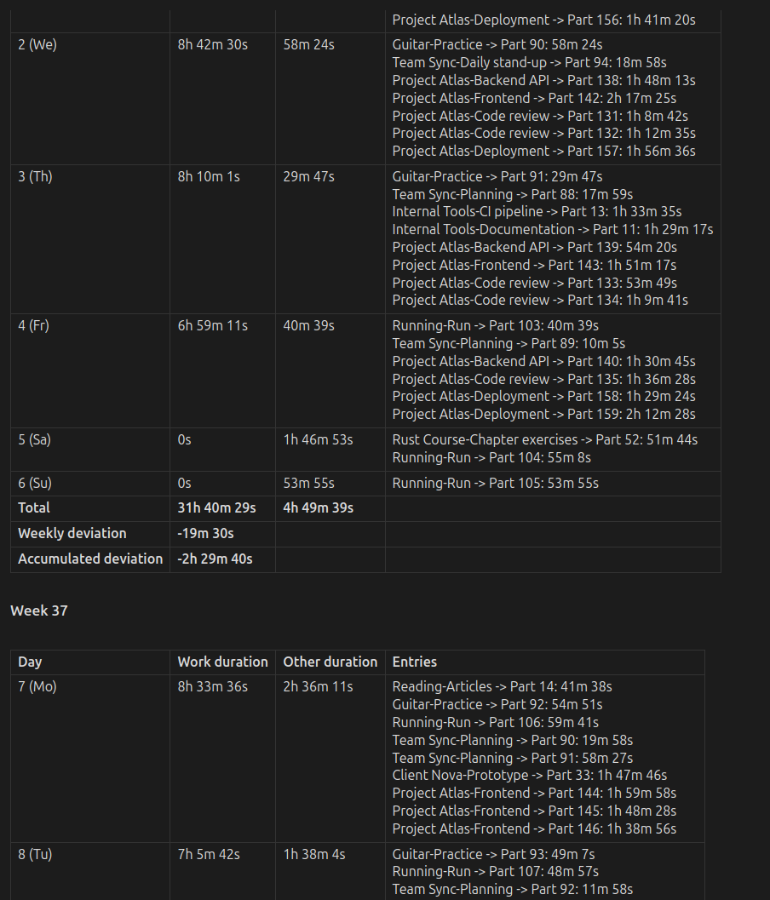
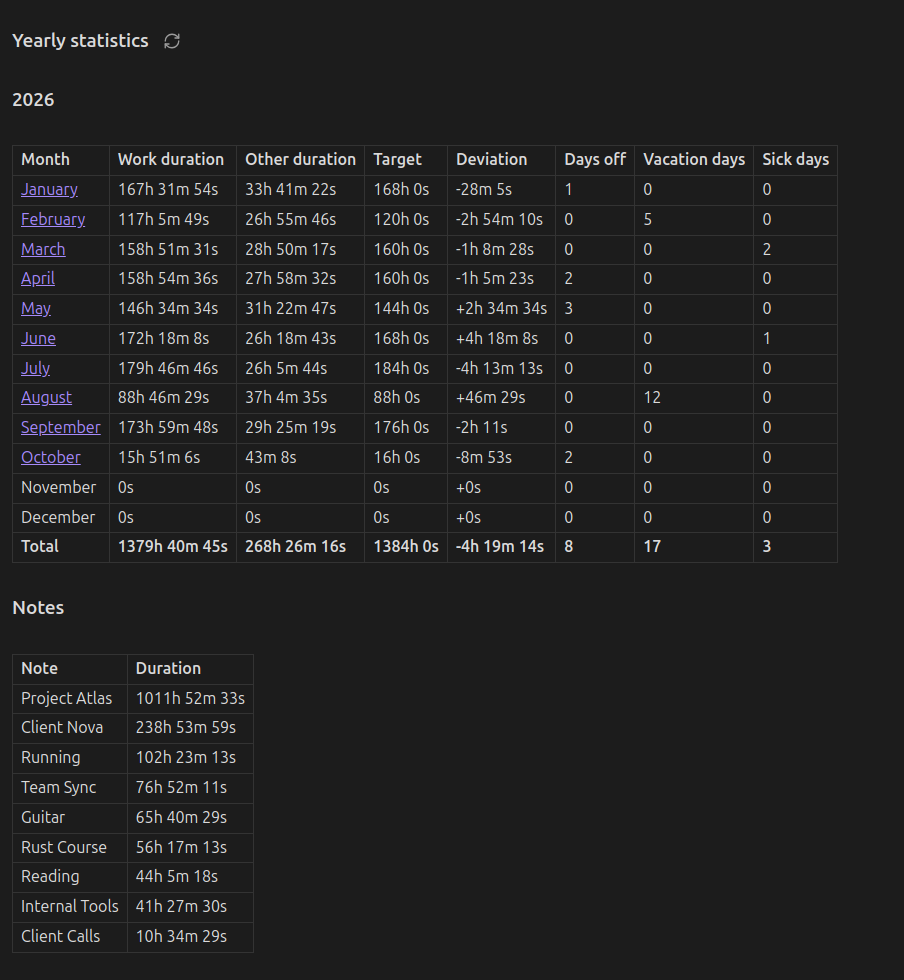
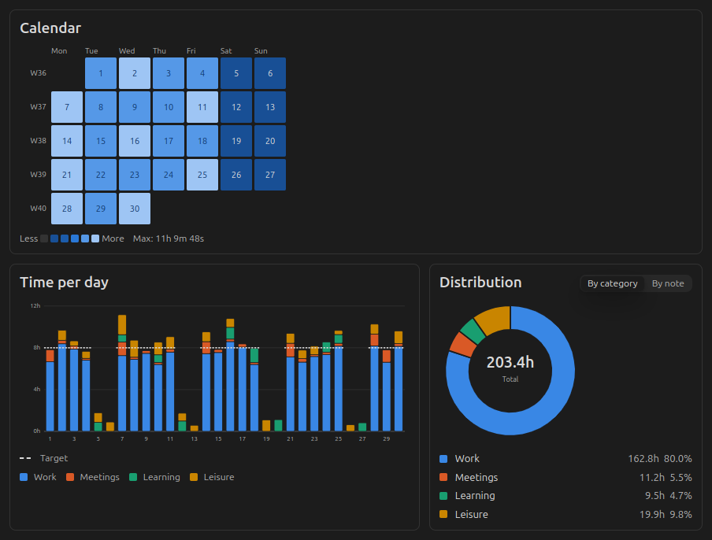
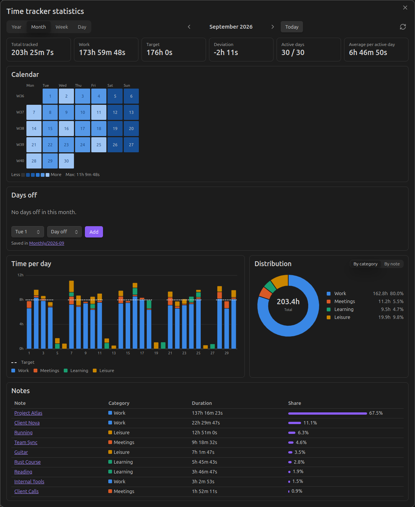

# Obsidian Time Tracker Statistics

This is a statistics companion plugin for the **[Super Simple Time Tracker](https://github.com/Ellpeck/ObsidianSimpleTimeTracker)** by [Ellpeck](https://github.com/Ellpeck).
It collects the time tracked in all notes of your vault and summarises it in daily, weekly, monthly and yearly reports: time per category, per entry and per note, compared against your daily targets. An interactive dashboard shows the same data as charts.

- Summarises tracked time without the need for custom scripts or coding.
- Identifies the relevant period from the name of the note that contains the code block:
    - **Daily**: `YYYY-MM-DD` (e.g., `2026-02-01.md`).
    - **Weekly**: `YYYY-Www` (e.g., `2026-W05.md`).
    - **Monthly**: `YYYY-MM` (e.g., `2026-02.md`).
    - **Yearly**: `YYYY` (e.g., `2026.md`).
- Automatically groups tracked entries into categories based on file tags defined in your settings.
- You can add a target time for a category and the reports will show you how much you deviated from it. Weekends are excluded from the target automatically, and you can mark public holidays, vacation days and sick days, either in the dashboard or in the monthly note, so the deviation calculation takes them into account.
- Optionally shows the dashboard charts below the tables in your notes.

## Different Views

All code blocks have a refresh button next to their title. Entries are assigned to the day on which they were started, in your local time zone.

Targets are only counted **up to today**, so the deviation of the current week, month or year shows where you stand right now instead of counting days that haven't happened yet.

### 1. Daily Statistics

Provides a summary of all time tracked for a specific calendar day.

- **Command**: `Insert daily statistics`.
- **Code Block**: `simple-time-tracker-statistics-day`.

**Includes:**

- **Running Tracker**: Displays a link to any active tracker found in the vault.
- **Totals Table**: Duration, remaining time and overtime per category based on your set targets, and the deviation. On weekends and on days marked as off, vacation or sick, there is no target, so all work time counts as overtime. With the [daily target period](#daily-target-period) set to *Week so far*, a *Week so far* column is added and remaining time, overtime and deviation cover the week up to that day.
- **Entries Breakdown**: A detailed list of every entry, showing the source file and sub-entry hierarchy.

### 2. Weekly Statistics

All days of one week with their work time, other time and entries.

- **Command**: `Insert weekly statistics`.
- **Code Block**: `simple-time-tracker-statistics-week`.

**Includes:**

- **Week Table**: One row per day, marked days off included, with the weekly total and deviation.
- **Notes**: The time per note in that week.

Weeks are numbered according to the *First day of week* setting: ISO weeks (week 1 contains 4 January) when weeks start on Monday, US weeks (week 1 contains 1 January) when they start on Sunday.

### 3. Monthly Statistics

A comprehensive report grouping entries by week and calculating long-term time balances.

- **Command**: `Insert monthly statistics`.
- **Code Block**: `simple-time-tracker-statistics-month`.

**Includes:**

- **Carry-Over**: The deviation carried over from the previous month (see [Automatic Carry-Over](#automatic-carry-over)).
- **Week Tables**: One table per week with the weekly deviation and the accumulated deviation of the month.
- **End of Month Summary**: The deviation of the month itself and the total accumulated deviation including the carry-over, the number of days off, vacation and sick days, and the time per note.

The monthly note also stores your days off, see [Managing Time Off](#managing-time-off).

### 4. Yearly Statistics

An overview of the whole year, one row per month.

- **Command**: `Insert yearly statistics`.
- **Code Block**: `simple-time-tracker-statistics-year`.

**Includes:**

- **Month Table**: Work time, other time, target, deviation and the number of days off, vacation and sick days per month, with a link to each monthly note.
- **Notes**: The time per note in that year.

The yearly deviation covers that year only. The monthly notes carry the balance over from one year to the next.

### Charts in Notes

Turn on **Show charts in notes** in the settings to add the dashboard charts (heatmap, bar chart and distribution) below the tables of every code block. The tables stay at the top. Clicking a day or month in a chart opens it in the dashboard. The option is off by default.

### 5. Statistics Dashboard

A popup window with interactive charts for the whole vault. It works independently of any note, so you can use it alongside the code blocks or instead of them.

- **Command**: `Open statistics dashboard` (also available from the ribbon icon) opens the Day view. To jump straight to a view, use `Open statistics dashboard: year view`, `… month view`, `… week view` or `… day view`.
- **Views**: Year, Month, Week and Day. Navigate with the arrow buttons, the left/right arrow keys or *Today*.

**Each view includes:**

- **Summary tiles**: Total tracked time, work time, target, deviation of the period, accumulated deviation including the carry-over from the monthly notes, active days and daily average. For the current period, target and deviation are counted up to today.
- **Heatmap**: A calendar of daily totals (Year, Month), or the time tracked per hour (Week: per day, Day: per category). Days off are outlined.
- **Bar chart**: Time per month, day or hour, stacked by category, with the daily target marked.
- **Distribution**: A donut chart of the tracked time by category or by note.
- **Table**: Time per note, or every entry of the day in the Day view.
- **Days off**: Mark a day as workday, day off, vacation or sick in the Day view, or add and remove days off in the Month view (see [Managing Time Off](#managing-time-off)).

Click a day in a heatmap or bar chart to open it in the Day view, or a month bar in the Year view to open that month. Hourly charts split entries by clock time, so an entry that runs past midnight appears on both days.

#### Day view

Hours by category, time per hour and every entry of the day.

#### Week view

An hour-by-day heatmap shows when you worked; the bars compare each day with the daily target.

#### Month view

A calendar heatmap of daily totals. Hover over any cell or bar for details.

#### Year view

A contribution-style heatmap of the whole year and the time per month against the monthly target.

#### Distribution by note

## Managing Time Off

The daily work target only applies from Monday to Friday. Saturdays and Sundays never add to the target. You can exclude further days from your standard work obligations to keep your deviation accurate.

Days off are stored in the code block of the **monthly note** (`YYYY-MM.md`) and apply to all views: the daily, weekly, monthly and yearly code blocks as well as the dashboard. There are two ways to set them:

- **In the dashboard**: Use the *Day type* card in the Day view or the *Days off* card in the Month view. The change is written to the monthly note right away. If the month has no note yet, one is created in the **Monthly notes folder** set in the settings, with `deviation = auto`.
- **In the code block**: Edit the lists of the monthly statistics block directly.

A day can only have one type. Setting a new type replaces the old one.

### Configuration Parameters

|Parameter|Type|Description|
|---|---|---|
|**`deviation`**|`auto` \| `number`|Deviation carried over from the previous month. `auto` calculates it from the previous month's note (see below). A number (in **milliseconds**) sets it manually, e.g. copied from the *Total accumulated deviation (ms)* row of the previous month's summary.|
|**`vacationDays`**|`number[]`|Days of the month to be excluded from work targets (e.g., `[1, 2, 3]`).|
|**`sickDays`**|`number[]`|Dates marked as sick leave; reduces the work target.|
|**`daysOff`**|`number[]`|Public holidays or other non-working days. Weekends don't need to be listed.|

### Automatic Carry-Over

With `deviation = auto` (the default for newly inserted blocks and for notes created by the dashboard), the plugin looks for the previous month's note by its file name (e.g. `2026-09.md` for `2026-10.md`) and uses that month's total accumulated deviation as the starting value. The link to the source note is shown above the first week.

- If the previous note also uses `auto`, the plugin keeps going back month by month.
- The chain stops at the first note with a numeric `deviation`, or at the first month without a note (which counts as `0`).
- Past months are recalculated with your **current** category targets. If your targets changed, set a numeric `deviation` in the first month with the new targets to freeze the earlier values.

## Settings

### Categories

To make the statistics meaningful, map your vault's tags to categories. The plugin comes pre-configured with two default categories: **Work** (target `08:00:00`) and **Leisure** (target `00:00:00`).

1. **Define a Category**: Give it a name.
2. **Assign Tags**: Add the tags you use to indicate the files associated with the category. By default, **Work** looks for `#work` and **Leisure** looks for `#leisure`. Notes without a matching tag are grouped as **Other**.
3. **Set Targets**: Enter a target in `HH:mm:ss` format and choose whether it applies **per day** or **per week**. If left blank, the target defaults to `00:00:00`. A weekly target is spread evenly over the five weekdays, so `20:00:00` per week equals `04:00:00` per day, and a day off, vacation or sick day reduces the week by one fifth.
4. **Work Tracking**: Every category with a target above `00:00:00` counts as work, and so does a category without a target that fills other targets (see [Target Rules](#target-rules)). The daily target is the sum of these targets. All other categories are shown as "Other duration".

### Target Rules

Turn on **Target rules** to let the time of one category fill the target of other categories. The option is off by default and hides the rules; turning it off again ignores them without deleting them. A category can only fill categories with a target, but it doesn't need a target itself.

For each category, choose the categories it fills. Its time first fills their remaining target, in the chosen order, and only the time left counts for its own target. Example with the categories **Duty** (`#work/duty`, target `04:00:00`) and **Qualification** (`#work/qualification`, target `04:00:00`), where *Qualification fills Duty*:

|Tracked duty|Tracked qualification|Duty|Qualification|
|---|---|---|---|
|2h|5h|full (2h filled by qualification)|1h remaining|
|4h|5h|full|1h overtime|
|5h|2h|1h overtime|2h remaining|

So duty only gets overtime from duty time, and qualification only once both targets are full.

A category **without a target** that fills others, e.g. **Tool development** filling *Duty, then Qualification*, has no target of its own: its time reduces the remaining target of the categories it fills, and only the time left after they are full counts as overtime. Such a category counts as work time. Recording more duty later moves the qualification time back to its own target. The rules change the remaining time and overtime per category in the daily statistics; the daily target and the deviation stay the same, since they count all work time together.

### Daily Target Period

By default, the remaining time, overtime and deviation in the daily statistics only cover that day. Set **Daily target period** to *Week so far* to calculate them from the first day of the week up to that day instead. The target is the daily target times the target days of the week so far, and the target rules are applied to the time of the whole week so far. This suits targets that only need to balance out over the week, e.g. duty on some days and qualification on others. Combined with weekly category targets, e.g. `20:00:00` duty and `20:00:00` qualification per week, the daily statistics on Friday compare the week with the full 20 hours each. The *Target* and *Deviation* tiles of the dashboard's Day view follow the same setting.

### Other Settings

|Setting|Default|Description|
|---|---|---|
|**First day of week**|Monday|Start of the week in the weekly reports and the dashboard. Also decides how weeks are numbered (ISO or US).|
|**Monthly notes folder**|Vault root|Where the dashboard creates new monthly notes. Existing monthly notes are found anywhere in the vault.|
|**Show charts in notes**|Off|Adds the dashboard charts below the tables of the code blocks.|
|**Target rules**|Off|Shows the [target rules](#target-rules) and applies them.|
|**Daily target period**|Day|Whether the [daily statistics](#daily-target-period) compare a day with its own target or the week so far with its target.|

## Prerequisites

- **Simple Time Tracker**: Required for the underlying data and API.
- **Dataview**: Required for the plugin to scan and aggregate data.

## Network Use

After an update to a new major version (e.g. `2.0.0`), the plugin fetches that release's notes once from the GitHub API (`api.github.com`) to show them in a notice. No other data is sent or received.
